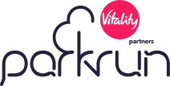

### Receive results from Park Run
Scrape public websites.  
Extract results of specified runners.  
Send email once all results in.  
Set up cron job locally for automation.

```
*/15 11-16 * * Sat ~/environment/non-rails-apps/parkrun-results/bin/results
```

set config/participations.yml
```
- name: "Martin Gichuhi"
  location: "ferry meadows"
- name: "Steven Baldwin"
  location: "huntingdon"
```

set configurations in .env<br>
create .env.secrets in root

```
### email
GMAIL_API_KEY=
EMAIL_FROM=
EMAIL_TO=
```

from project root:
```
$ ./bin/results
```

<br>